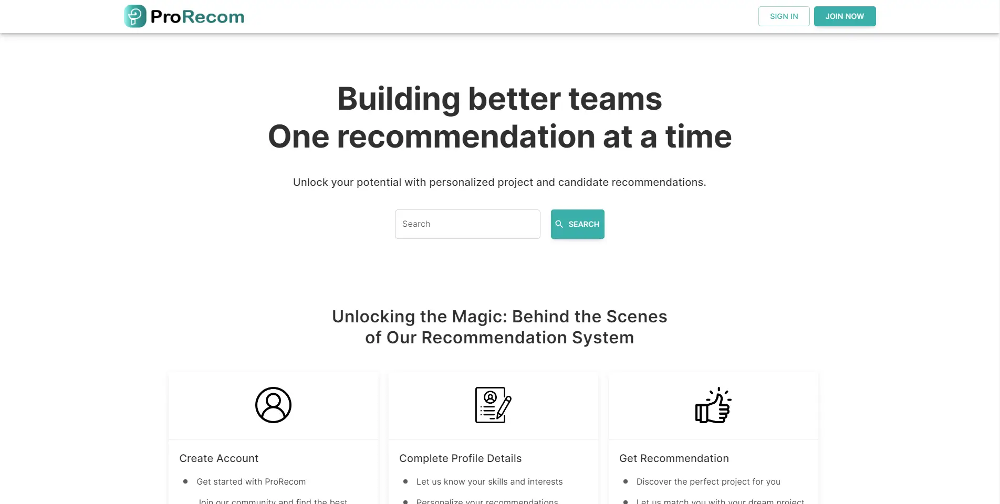

# ProRecom

ProRecom is an innovative web application designed to revolutionize the job-seeking and
recruitment processes by providing skillset-based project recommendations for job seekers
and identifying the best-fit candidates for companies. Leveraging skillset
extraction and unsupervised learning, ProRecom aims to address the limitations of
traditional recommendation systems and offer more accurate and relevant recommendations.

## Table of Contents

- [ProRecom](#prorecom)
  - [Table of Contents](#table-of-contents)
  - [Installation](#installation)
  - [Description](#description)
    - [Purpose](#purpose)
    - [Main Features](#main-features)
    - [How it Works](#how-it-works)
    - [Why Choose ProRecom](#why-choose-prorecom)
  - [Technologies](#technologies)
  - [Features](#features)
  - [Usage](#usage)
  - [Backend Reference](#backend-reference)

## Installation

[Provide step-by-step instructions on how to set up and install your project locally. Include any prerequisites and dependencies.]

1. Clone the repository: `git clone https://github.com/hingfei/prorecom_frontend.git`
2. Install dependencies: `npm install` or `yarn install`
3. Add .env file
4. Start the development server: `npm run dev` or `yarn dev`
5. Generate GraphQL APIs: `yarn generate:graphql`

## Description

### Purpose

ProRecom is an advanced web application that aims to revolutionize the job-seeking and
recruitment processes by leveraging cutting-edge skillset extraction and unsupervised learning
techniques. The primary purpose of ProRecom is to provide highly accurate and relevant project
recommendations to job seekers based on their unique skillsets. Simultaneously,
the platform offers candidate matching to companies seeking the best-fit candidates for
their projects. By bridging the gap between job seekers and companies, ProRecom strives to enhance
the efficiency and effectiveness of the job market, benefiting both individuals and organizations.

### Main Features

1. **Skillset-Based Recommendations**: ProRecom stands apart from traditional recommendation systems by focusing on
   skillset extraction. Job seekers create detailed profiles, including their skills, experience, and job preferences.
   The application's advanced algorithm then analyzes these profiles to extract key skillset keywords, forming the basis
   for personalized project recommendations.

2. **Project Listing**: ProRecom provides a comprehensive and up-to-date listing of various projects posted by companies
   across industries. Job seekers can easily search and view these projects, each accompanied by its detailed
   description, requirements, and company information.

3. **Project Application**: Job seekers are empowered to apply for projects directly through the platform.
   Additionally, job seekers have access to their application history, which includes details such as application
   status, company and project details.

4. **Candidate Recommendations**: For companies looking to fill project positions, ProRecom offers a candidate matching
   system. The platform analyzes project requirements and matches them with the extracted skillset keywords from
   potential candidates' profiles. This enables companies to identify the most suitable candidates quickly and
   efficiently.

5. **Project Invitation**: Companies have the option to invite candidates to apply for their projects after receiving
   candidate recommendations from the system. Using keywords such as locations and skill requirements, companies can
   search for potential candidates and send them personalized project invitations. Job seekers can then accept or reject
   these invitations within their application history.

6. **Push Notifications**: To keep users informed and engaged, ProRecom generates notifications for every relevant
   action,
   status update, or response. Job seekers and companies receive real-time notifications about project applications,
   invitations, and other activities, ensuring timely communication and updates.

### How it Works

1. **Job Seeker Profile**: Job seekers create profiles and upload their resumes, providing essential information about
   their
   skills, experience, and job preferences.

2. **Skillset Extraction**: ProRecom's skillset extraction algorithm analyzes the job seekers' profiles and project
   descriptions to extract relevant keywords representing their skillsets.

3. **Project Recommendations**: Based on the extracted skillset keywords, ProRecom generates personalized project
   recommendations that closely match each job seeker's expertise.

4. **Candidate Matching**: For companies posting projects, ProRecom matches the project requirements with the skillset
   keywords extracted from potential candidates' profiles. This enables companies to discover the most suitable
   candidates for their projects.

5. **Interactive Project Listing**: Job seekers can explore the project listing, view project details, and apply for
   projects directly through the platform.

### Why Choose ProRecom

#### Advantages for Job Seekers:

- Personalized Project Recommendations: ProRecom empowers job seekers with personalized project recommendations that
  align with their skillsets and career aspirations. This increases the likelihood of finding opportunities that best
  suit their expertise.

- Streamlined Job Search: The platform simplifies the job search process by presenting relevant projects in one
  centralized location. Job seekers can save time and effort by accessing curated recommendations that match their
  skills.

- Application History: Job seekers can easily track their application history, including the status of each application
  and responses from companies. This helps them stay organized and follow up on their job applications effectively.

- Project Invitation Management: Job seekers have control over project invitations received from companies. They can
  accept or reject invitations based on their preferences and availability.

#### Benefits for Companies:

- Efficient Candidate Matching: ProRecom streamlines the recruitment process for companies by providing a candidate
  matching system. The platform identifies the most suitable candidates based on their skillset keywords, saving
  valuable
  time in the candidate selection process.

- Access to Top Talent: By leveraging skillset extraction and recommendation technology, ProRecom enables companies to
  connect with top talent that best meets their project requirements.

- Streamlined Application Review: Companies can efficiently manage project applications through their dedicated
  dashboard.
  They have access to applicant profiles, documents, and project details, facilitating informed decisions on candidate
  selection.

- Effective Project Invitation: Companies can search for potential candidates using specific keywords and extend
  personalized project invitations. This targeted approach increases the likelihood of attracting suitable candidates
  for their projects.

## Technologies

- **Frontend**: React, Next.js, TypeScript, Material-UI
- **Backend**: FastAPI, Strawberry GraphQL, Apollo Server
- **Database**: SQLite
- **State Management**: Redux or Apollo Client

## Features

- User registration
- User authentication
- Profile management
- Project listing
- Project details
- Searching and filtering
- Project application
- Application history
- Project management
  - Add new projects
  - Edit existing projects
  - Delete existing projects
- Applications management
- Project invitation
- Push notifications

## Future Enhancements

- Enhanced Skillset Extraction: ProRecom will further refine its skillset extraction algorithm by analyzing additional
  fields, such as project descriptions and requirements. By considering a broader range of information, the platform
  will provide even more accurate and comprehensive skillset representations for job seekers, resulting in more precise
  project recommendations.

- Interactive Chat System: To facilitate direct and seamless communication between companies and job seekers, ProRecom
  will integrate an interactive chat system. This feature will enable real-time messaging, allowing companies to engage
  with potential candidates, discuss project details, and address any queries efficiently. The chat system aims to
  foster productive conversations and streamline the hiring process.

- Interview Appointment System: Recognizing the importance of timely and organized interviews, ProRecom will introduce
  an interview appointment system. Companies and job seekers can schedule interview sessions directly within the
  platform, eliminating the need for external scheduling tools. This feature will enhance the convenience and
  coordination of interview processes, leading to smoother interactions and efficient talent acquisition.

## Backend Reference

For backend reference, kindly visit https://github.com/hingfei/prorecom_backend
